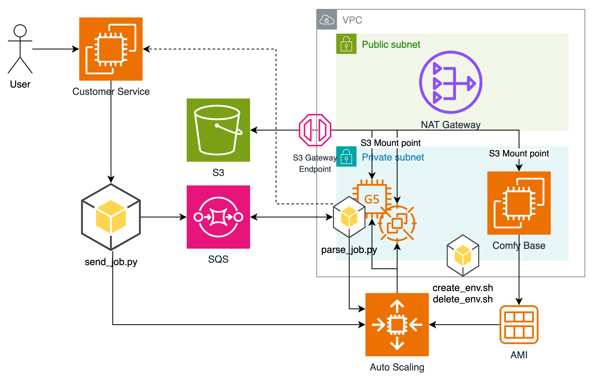

# 从开发到生产：在亚马逊云科技上打造高效经济的ComfyUI工作流

这是一个简单的 ComfyUI 任务管理和弹性的Demo，也可以稍微改动即可用在其他异步的需要弹性的场景，方案优势：

* 环境配置依赖等，在EC2上完成后，可以一键进行镜像，实现弹性扩展
* 空闲时，弹性组实例可以缩减到 0 节省费用，可以灵活控制弹性伸缩行为，处理缩容时的优雅退出
* 只依赖一个SQS队列实现异步，提供简单的发送和接收代码，可以轻松扩展
* 对于经常改动的依赖（例如版本升级，模型下载，输入输出等），挂载s3或efs，避免反复更新AMI镜像和加速启动过程



## 工作流程

* 制作基础环境 Comfy Base
* 通过 create_env.sh 一键创建环境，delete_env.sh 删除环境
  * 通过 Comfy Base 制作 AMI 镜像
  * 配置弹性伸缩环境
  * 复制S3环境
  * 配置sqs
* 业务代码中，修改为调用 send_job.py 进行任务分发
  * 发送任务到 sqs 上
  * 拉起实例处理任务
* 弹性环境起来之后，内置的 parse_job.py 将会运行
  * 实例正常运行后，会到 sqs 上获取任务
  * 进行任务执行
  * 完成之后，可对业务逻辑进行回调（虚线部分）
  * 判断队列深度，控制实例的缩放，优雅退出

## 配置 Comfy 基础环境

* 启动ec2实例，并制作comfy环境，这里使用实例如下：
  * 实例类型：g5.2xlarge
  * 操作系统：Ubuntu 24.04
  * 建议在私网中部署，通过 会话管理器 登录实例，由于 ComfyUI 界面没有权限管理，建议在公有子网中配置跳板机，利用ssh隧道进行机器访问
  * 默认方案无需开启任何安全组规则，如果需要直接访问 ComfyUI 的 Web 服务，注意配置相应安全组规则
  * 磁盘EBS：gp3, 50G
  * 注意：VPC 中应配置 S3 的 Gateway endpoint 以避免访问S3产生额外的 NAT Gateway 流量费。

### 授予权限

因为后续脚本都建议在 ec2 上运行，由于弹性伸缩组也需要对应权限，建议使用 ec2 角色进行授权

* 打开 IAM 控制台：https://us-east-1.console.aws.amazon.com/iam/home?region=us-east-1#/roles
* 点击 创建角色，在服务中选择“EC2”，点击 下一步
* 搜索并选中以下权限（这里方便演示，权限都比较大，后续可以根据需求缩减）
  * AmazonEC2FullAccess：用于制作镜像，创建启动模版等
  * AmazonS3FullAccess：用于s3访问，加载模型和写入日志等
  * AmazonEFSCSIDriverPolicy：用于EFS访问，如果没有选择EFS可以不配置
  * AmazonSQSFullAccess：用于创建SQS，提交和获取任务
  * AutoScalingFullAccess：用于管理弹性伸缩
  * CloudWatchFullAccessV2：用于观察指标
  * IAMFullAccess：用于启动模版的角色传递，主要用到 PassRole
* 输入角色名字，如：simple-comfy-role，并完成创建。
* 打开 EC2 控制台：https://console.aws.amazon.com/ec2/home
* 找到实例并选中，点击右上方的 操作 -> 安全 -> 修改IAM角色
* 选中刚才创建的角色，点击 更新IAM角色

### 安装配置 Nvidia 驱动

以下代码进行云上的显卡驱动设置，详情可以参考官方文档：https://docs.aws.amazon.com/AWSEC2/latest/UserGuide/install-nvidia-driver.html#nvidia-gaming-driver

``` bash
# 如果是 ssm 登录，先切换到 ubuntu 账号
sudo -i -u ubuntu

sudo apt-get update -y

# 安装 aws cli
sudo apt install unzip
curl "https://awscli.amazonaws.com/awscli-exe-linux-x86_64.zip" -o "awscliv2.zip"
unzip awscliv2.zip
sudo ./aws/install

# 安装 nvdia driver
sudo apt-get install -y gcc make build-essential
sudo apt-get upgrade -y linux-aws
# 重启实例以加载最新内核版本
sudo reboot
```

``` bash
# 如果是 ssm 登录，先切换到 ubuntu 账号
sudo -i -u ubuntu
sudo apt install -y unzip dkms linux-headers-$(uname -r)
cat << EOF | sudo tee --append /etc/modprobe.d/blacklist.conf
blacklist vga16fb
blacklist nouveau
blacklist rivafb
blacklist nvidiafb
blacklist rivatv
EOF
sudo sed -i 's/^GRUB_CMDLINE_LINUX=".*"$/GRUB_CMDLINE_LINUX="rdblacklist=nouveau"/' /etc/default/grub
sudo update-grub
aws s3 cp --recursive s3://nvidia-gaming/linux/latest/ .
unzip *Gaming-Linux-Guest-Drivers.zip -d nvidia-drivers
chmod +x nvidia-drivers/NVIDIA-Linux-x86_64*-grid.run
sudo nvidia-drivers/NVIDIA-Linux-x86_64*.run
# 接受默认选项
cat << EOF | sudo tee -a /etc/nvidia/gridd.conf
vGamingMarketplace=2
EOF
sudo curl -o /etc/nvidia/GridSwCert.txt "https://nvidia-gaming.s3.amazonaws.com/GridSwCert-Archive/GridSwCertLinux_2024_02_22.cert"
sudo touch /etc/modprobe.d/nvidia.conf
echo "options nvidia NVreg_EnableGpuFirmware=0" | sudo tee --append /etc/modprobe.d/nvidia.conf

# 一定要安装下面的包，不然会导致 EC2 重启后 GPU Driver 不能 work
sudo apt-get install -y nvidia-cuda-toolkit
sudo apt-get install -y ubuntu-drivers-common
sudo ubuntu-drivers autoinstall
sudo reboot
```

### 安装Comfy

```bash
# 如果是 ssm 登录，先切换到 ubuntu 账号
sudo -i -u ubuntu

# 指定python环境
sudo apt install -y python3.12-venv
python3 -m venv venv
. venv/bin/activate
pip install comfy-cli
# 一路y即可
comfy install
```

### 配置S3或EFS，实现压缩系统镜像，加速开发和升级的目的

* 把大文件放到S3或者EFS上，通过本地文件夹的方式加载到机器中，实现压缩系统镜像，加速开发和升级的目的。
* S3 Mount Point在文件顺序读取时，可以用满机器带宽（如 g5.2xlarge 速度可以达到Brust的10Gbps）。
* 需要考虑有些模型文件可能不是顺序读取的，例如 SafeTensors 格式设计时考虑了内存映射（memory mapping）功能，文件头部包含元数据，描述了各个张量在文件中的位置和大小，这时可能会引起文件的随机读取。
* S3 由于是通过HTTP的方式获取，在大量随机读取时，性能没有磁盘好，这时可以考虑使用EFS，或先把文件拷贝到 EBS 或 实例存储 上使用。

#### 安装S3映射，用于目录直接挂载S3

```bash
# 安装 S3 驱动
wget https://s3.amazonaws.com/mountpoint-s3-release/latest/x86_64/mount-s3.deb
sudo apt-get install ./mount-s3.deb -y
# 默认aws sdk启用crt特性，提高拷贝性能，用于 aws s3 cp
aws configure set default.s3.preferred_transfer_client crt
# （可选）安装 s5cmd 用于s3快速拷贝
# https://github.com/peak/s5cmd
wget https://github.com/peak/s5cmd/releases/download/v2.3.0/s5cmd_2.3.0_Linux-64bit.tar.gz
tar xzvf s5cmd_2.3.0_Linux-64bit.tar.gz
sudo mv s5cmd /usr/local/bin/
rm -rf s5cmd_2.3.0_Linux-64bit.tar.gz
```

#### (可选)：安装EFS驱动，用于使用EFS网盘的情况

通过NFS网盘的方式，可以有更高的随机读取性能，减少开始加载模型的等待时间，价格上会比s3贵一些

```bash
sudo apt-get -y install git binutils rustc cargo pkg-config libssl-dev
git clone https://github.com/aws/efs-utils
cd efs-utils
./build-deb.sh
sudo apt-get -y install ./build/amazon-efs-utils*deb
#加载网盘
mkdir -p /home/ubuntu/comfy/efs
sudo mount -t efs -o tls fs-xxx:/ /home/ubuntu/comfy/efs
#开机挂载
echo "fs-xxx:/ /home/ubuntu/comfy/efs efs defaults,_netdev,tls 0 0" >> /etc/fstab

# 首次挂载需要初始化一下权限
cd /home/ubuntu/comfy
sudo chown ubuntu:ubuntu efs
sudo chmod 755 efs
```

## 部署本程序

### 安装脚本

```bash
wget https://github.com/aws-samples/aws-global-accelerator-custom-routing-workshop/raw/refs/heads/main/stack/comfy-on-ec2/scripts.zip -O /home/ubuntu/comfy/scripts.zip
cd /home/ubuntu/comfy/
unzip scripts.zip
# 注意应该在上面的venv环境中执行
. /home/ubuntu/venv/bin/activate
pip install boto3 dotenv

# 程序用到的变量，生成标准环境（base）下的env文件：
ACCOUNT_ID=$(aws sts get-caller-identity --query "Account" --output text)
TOKEN=$(curl -s -X PUT "http://169.254.169.254/latest/api/token" -H "X-aws-ec2-metadata-token-ttl-seconds: 21600")
INSTANCE_ID=$(curl -s -H "X-aws-ec2-metadata-token: $TOKEN" http://169.254.169.254/latest/meta-data/instance-id)
REGION=$(aws ec2 describe-instances --instance-ids $INSTANCE_ID --query 'Reservations[0].Instances[0].Placement.AvailabilityZone' --output text | sed 's/[a-z]$//')
echo "ENV=base" > /home/ubuntu/comfy/env
echo "PREFIX=simple-comfy" >> /home/ubuntu/comfy/env
echo "ACCOUNT_ID=${ACCOUNT_ID}" >> /home/ubuntu/comfy/env
echo "REGION=${REGION}" >> /home/ubuntu/comfy/env
echo "S3_BUCKET=\${PREFIX}-\${ACCOUNT_ID}-\${REGION}-\${ENV}" >> /home/ubuntu/comfy/env
echo "SQS_NAME=\${PREFIX}-\${ENV}-queue" >> /home/ubuntu/comfy/env
echo "ASG_NAME=\${PREFIX}-\${ENV}-asg" >> /home/ubuntu/comfy/env
echo "INSTANCE_TYPE=g5.2xlarge" >> /home/ubuntu/comfy/env
echo "MIN_INSTANCES=0" >> /home/ubuntu/comfy/env
echo "MAX_INSTANCES=20" >> /home/ubuntu/comfy/env
echo "BACKLOGSIZE_PER_INSTANCE=3" >> /home/ubuntu/comfy/env
echo "SCALE_COOLDOWN=180" >> /home/ubuntu/comfy/env

# 如果需要调整其他变量，在这里修改 env 文件，但建议尽量不做修改
```

#### 考虑生产环境模型的存放方式

##### 使用 S3 Mount Point 直接加载模型（默认方案）

* 优点
  * 比较灵活，维护简单
  * 具体使用什么模型就直接从s3自动加载，s3上可以放置很多模型，不需要的模型不会加载
* 缺点
  * 有些模型加载时可能会进行随机读取，这时s3加载可能会性能差一些
  * 如果生产环境启动需要较长时间，建议把模型复制到本地

##### 初始化时把模型复制到本地

* 优点
  * 初始化时先顺序+多线程把模型复制到本地磁盘，后续模型在本地加载
  * 尤其有 实例存储 的机型（例如 g5.2xlarge 有450GB实例存储），使用 实例存储能带来最优的性能和最低成本
  * 频繁切换模型，不需要从s3重新加载
  * 对于需要随机读取的模型性能最优
* 缺点
  * 需要复制目录内所有模型，需要精细维护不同工作流使用不同的模型
  * 模型更新之后，实例中的数据需要重新下载或进行机器替换

！！！请注意！！！如果进行了模型复制，请确保模型更新都以s3上的为准。

```bash
# 如果选择 生产环境机器初始化时把模型复制到本地，请选择执行以下命令：
# 使用 aws cli 进行模型复制
echo "COPY_MODEL_TO_LOCAL=awscli" >> /home/ubuntu/comfy/env
# 使用 s5cmd 进行模型复制
echo "COPY_MODEL_TO_LOCAL=s5cmd" >> /home/ubuntu/comfy/env
```

##### 使用 EFS 加载模型（请自行调整实现逻辑）

* 优点
  * 比较灵活，维护简单
  * EFS适合随机读取场景
* 缺点
  * 有额外费用，顺序读取性能不能把带宽打满

#### 标准环境的额外配置

标准环境是给测试开发使用的，因此不需要配置弹性伸缩，我们只需要配置一下 SQS （和生产环境保持一致，方便测试）和标准环境的 S3 桶。

```bash

source /home/ubuntu/comfy/env
# 创建标准环境的queue，这样也便于后续对base环境进行测试
aws sqs create-queue --queue-name "${SQS_NAME}" --region ${REGION}
# 注意：标准环境用于测试，不建议创建弹性伸缩组
```

### 使用ComfyUI的初始目录数据制作标准环境的s3桶

```bash
# 使用默认的Comfy Model目录内容创建 s3 基础环境 base
source /home/ubuntu/comfy/env
# 兼容美东一的创建s3桶方法
([ "$REGION" == "us-east-1" ] && aws s3api create-bucket --bucket "$S3_BUCKET" --region "$REGION" || aws s3api create-bucket --bucket "$S3_BUCKET" --region "$REGION" --create-bucket-configuration LocationConstraint="$REGION")
# 加载s3桶
mkdir /home/ubuntu/comfy/s3
mount-s3 ${S3_BUCKET} /home/ubuntu/comfy/s3 --allow-delete --allow-overwrite
```

如果已经有做好的s3桶，可以直接通过桶的复制完成

```bash
aws s3 sync s3://<已经做好的桶>/ s3://${S3_BUCKET}/ --delete --region "$REGION"
```

全新制作：使用Comfy的初始内容进行创建

```bash
# 注意这里会和s3保持完全一致的同步，如果s3本身有数据，会被删除
aws s3 sync /home/ubuntu/comfy/ComfyUI/models s3://${S3_BUCKET}/models --delete
aws s3 sync /home/ubuntu/comfy/ComfyUI/input s3://${S3_BUCKET}/input --delete
aws s3 sync /home/ubuntu/comfy/ComfyUI/output s3://${S3_BUCKET}/output --delete
# 这里把本地目录清空以节省磁盘空间，加快实例启动速度，注意如果s3 mount异常，目录中就会是空的
rm -rf /home/ubuntu/comfy/ComfyUI/models /home/ubuntu/comfy/ComfyUI/input /home/ubuntu/comfy/ComfyUI/output
# 把 model input output 目录使用s3桶数据来代替
ln -s /home/ubuntu/comfy/s3/input /home/ubuntu/comfy/ComfyUI/
ln -s /home/ubuntu/comfy/s3/output /home/ubuntu/comfy/ComfyUI/
ln -s /home/ubuntu/comfy/s3/models /home/ubuntu/comfy/ComfyUI/
```

### 配置系统服务

配置为开机启动的系统服务，这里会创建两个服务 comfyui 是 ComfyUI 本身的服务（依赖于s3mount），comfy-manage 是任务调度的服务。

由于一些服务的条件限制，为了先执行完成cloud-init（进行env环境变量替换），并应用上面env中的变量，这里最终选择了启动脚本进行判断的逻辑，详见 start_service.sh

```bash
# 不能设置 After=cloud-init.target Wants=cloud-init.target Requires=cloud-final.service 会有循环引用
# 不能用 EnvironmentFile 读取变量文件，因为不支持多重变量
# 不能用 ExecStartPre 等待，有可能造成超时
# 不能用 ConditionPathExists=/var/lib/cloud/instance/boot-finished 判断 cloud init 完成，因为跳过就不会重试
cat << EOF | sudo tee /etc/systemd/system/comfyui.service
[Unit]
Description=ComfyUI Service
After=network-online.target
Requires=network-online.target

[Service]
User=ubuntu
WorkingDirectory=/home/ubuntu/comfy/ComfyUI
ExecStart=/home/ubuntu/comfy/start_service.sh comfyui
Restart=always

[Install]
WantedBy=multi-user.target
EOF

cat << EOF | sudo tee /etc/systemd/system/comfy-manage.service
[Unit]
Description=ComfyUI Service
After=network-online.target
Requires=network-online.target

[Service]
User=ubuntu
WorkingDirectory=/home/ubuntu/comfy
ExecStart=/home/ubuntu/comfy/start_service.sh comfy-manage
Restart=always

[Install]
WantedBy=multi-user.target
EOF

sudo systemctl daemon-reload
sudo systemctl enable comfyui.service
sudo systemctl start comfyui.service
sudo systemctl enable comfy-manage.service
sudo systemctl start comfy-manage.service
```

至此，可以查看 ComfyUI 的 Web界面并进行测试。

### 日志排查

如果服务启动失败，可以打印系统的整个启动日志进行分析，后续在弹性伸缩组中，也是用这种方式排错

```bash
# 系统启动后所有服务的运行情况
sudo journalctl -b

# 查看上一次启动的日志
sudo journalctl -b -1

# 查看具体服务状态和日志
systemctl status comfyui
journalctl -f -u comfyui

systemctl status comfy-manage
journalctl -f -u comfy-manage
# 查看 parse_job.py 的日志
tail -F /home/ubuntu/comfy/logs/
# journalctl -b| grep `ps aux | grep parse_job | grep -v grep | awk '{print $2}'`

# 如果弹性实例已经销毁，可以直接查看s3桶上的日志
# 设置当前变量指向pro环境
source <(sed 's/^ENV=.*$/ENV=pro/' /home/ubuntu/comfy/env)
# 列出所有实例id
aws s3 ls s3://${S3_BUCKET}/output/ | grep "i-"
  PRE i-0b0f65228098d31dd/
  PRE i-0c0927f2c910ee57a/
# 打印日志
aws s3 cp s3://${S3_BUCKET}/output/i-0b0f65228098d31dd/parse_job.log -
```

## 测试Comfy工作流

* 平时使用，只需要下载模型直接保存models目录，可以看到文件就保存在s3上了。
* 也可以下载模型到s3上，机器上也能直接看到模型。
* 也可以通过 send_job.py 发送指令到机器上，实现机器上直接下载模型。

``` bash
# 以下是一个测试例子
# 下载演示工作流用到的相关模型
wget "https://huggingface.co/linsg/AWPainting_v1.5.safetensors/resolve/main/AWPainting_v1.5.safetensors?download=true" -O /home/ubuntu/comfy/ComfyUI/models/checkpoints/AWPainting_v1.5.safetensors
wget "https://huggingface.co/hakurei/waifu-diffusion-v1-4/resolve/main/vae/kl-f8-anime2.ckpt?download=true" -O /home/ubuntu/comfy/ComfyUI/models/vae/kl-f8-anime2.ckpt
wget "https://huggingface.co/ac-pill/upscale_models/resolve/main/RealESRGAN_x4plus_anime_6B.pth?download=true" -O /home/ubuntu/comfy/ComfyUI/models/upscale_models/RealESRGAN_x4plus_anime_6B.pth
wget "https://huggingface.co/lllyasviel/ControlNet-v1-1/resolve/main/control_v11f1e_sd15_tile.pth?download=true" -O /home/ubuntu/comfy/ComfyUI/models/controlnet/control_v11f1e_sd15_tile.pth
wget "https://huggingface.co/Comfy-Org/stable-diffusion-v1-5-archive/resolve/main/v1-5-pruned-emaonly-fp16.safetensors?download=true" -O /home/ubuntu/comfy/ComfyUI/models/checkpoints/v1-5-pruned-emaonly-fp16.safetensors

# 观察日志
journalctl -b -f
```

* 测试工作流通过后，可以下载工作流API json，后面测试使用。
* （可选）可以通过配置 input 和 output 目录的事件触发，实现上传文件到s3上就可以触发提交任务，或者文件生成到output后，就触发响应对应逻辑，来定制自己的工作流。

## 部署线上弹性环境

* 线上环境是弹性伸缩组，s3，sqs 三者对应的，这样也避免开发环境有问题直接影响线上环境。
* 从标准环境base ec2中，创建对应线上环境，注意环境名只能使用小写。
* 默认会找到所有ec2所在VPC的私有子网进行弹性部署，如果vpc中没有私有子网，会选择所有子网。

```bash
# 在标准环境base ec2中直接运行
./create_env.sh pro

# 如果是在其他地方运行，需要增加机器的instance_id，并依赖env文件，注意profile指定的region
./create_env.sh pro i-06fxxxxx
```

* 注意，由于创建系统镜像时，默认没有强制重启机器，建议检查文件完整性是否都已经生效。
* 创建环境后，镜像制作需要一段时间，虽然这个时候已经可以测试，但是弹性伸缩组还是会等到镜像制作完成才开始启动机器。

## 测试提交任务

* 发送任务程序 send_job.py 中提供了演示代码供参考
* 该文件可以独立部署，按需集成到业务代码中
* 注意：环境依赖env、comfy_utils.py文件，和演示的工作流simple_workflow.json
* env文件只需要改动里面的 ENV=base 就是对应不同的环境。

```bash
python send_job.py

Message sent successfully: c29f8168-8e7e-428a-a936-f76a6d287567
Job submitted successfully
Current queue size: 1
Current instance count: 0
Starting first instance...
Adjusted ASG capacity to 1

# 可以看到机器已经启动
```

* 例子中还提供了一些便捷指令，例如可以通过 exec_cmd 在 base 环境中执行下载模型的任务：

```bash
execute_data = {
    "exec_cmd": "wget 'https://huggingface.co/linsg/AWPainting_v1.5.safetensors/resolve/main/AWPainting_v1.5.safetensors?download=true' -O /home/ubuntu/comfy/ComfyUI/models/checkpoints/AWPainting_v1.5.safetensors",
}
```

*（可选）可以在 parse_job.py 中添加业务逻辑通知回调代码，实现自己的业务逻辑
  * 在任务完成后，进行回调操作：在 parse_job.py 中查找关键字：# 这里可以添加自定义任务的业务回调处理
  * 在机器要缩容时，进行退出前的善后工作：在 parse_job.py 中查找关键字：# 这里可以添加自定义善后工作逻辑

* 也可以直接调整弹性伸缩组的设置：

```bash
# 注意如果修改了 min/max size，需要在env文件里做对应修改
# --min-size 0 --max-size 5 
aws autoscaling update-auto-scaling-group --auto-scaling-group-name simple-comfy-<ENV> --desired-capacity 1
```

## 删除环境

```bash
# 依赖 env 配置文件
# 需要注意弹性伸缩组是异步删除的，如果刚删除完，又马上创建相同的名字的环境，可能会造成冲突，需要先等待原来的环境删除完成再试。
./delete_env.sh pro
```

## 其他参考

* https://aws.amazon.com/cn/blogs/china/using-ec2-to-build-comfyui-and-combine-it-with-krita-practice/
* https://docs.aws.amazon.com/zh_cn/AmazonS3/latest/userguide/mountpoint-installation.html#mountpoint.install.deb
