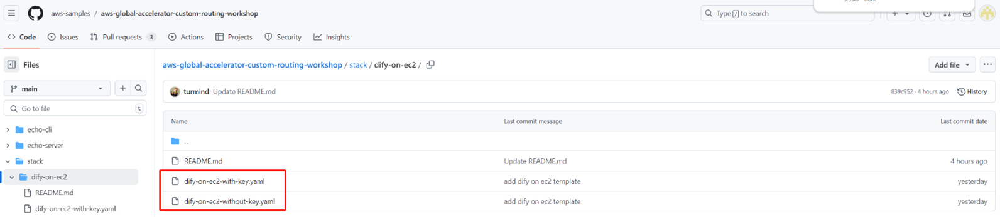
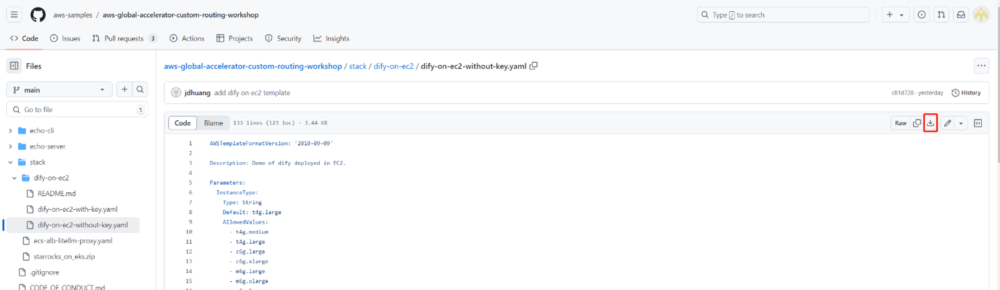
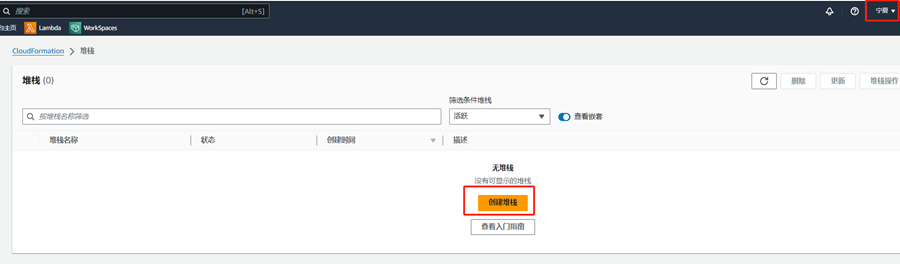
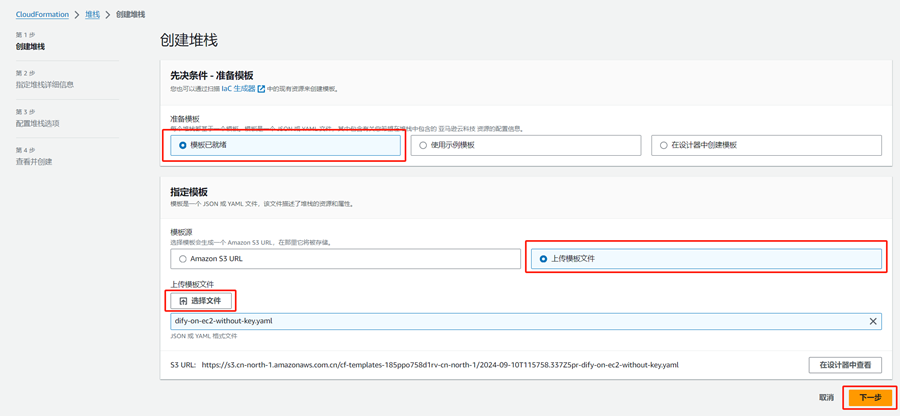
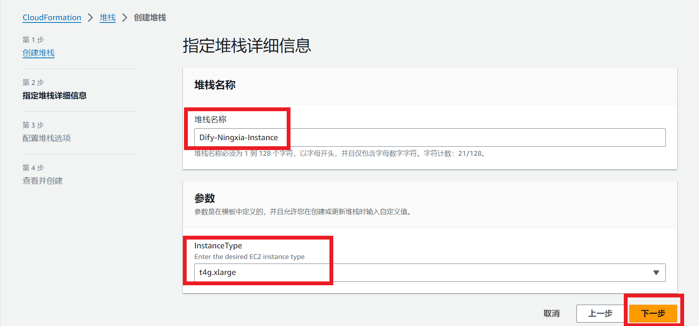
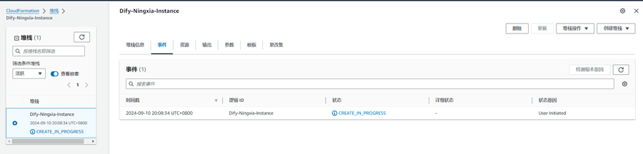
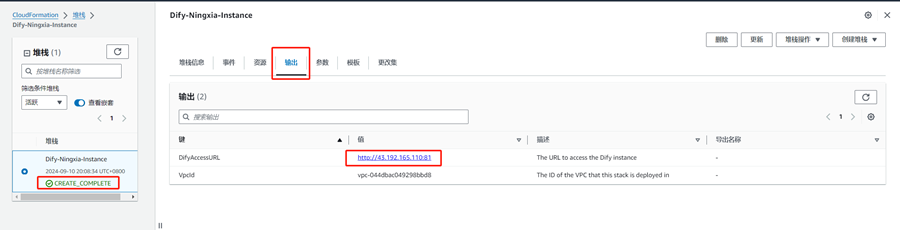
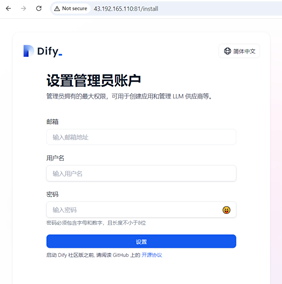
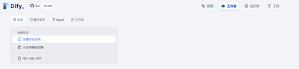

# 全网最高性价比Dify私有化部署，快速构建企业生成式AI应用

## 背景和目标

生成式 AI（Generative AI）和大语言模型（LLM）不仅大大提升和重塑个人信息获取和工作效率，也正在重塑企业应用。很多企业正在探索和部署基于独立环境的 LLM的包括增强检索生成（RAG）、Agent 以及工作流（Workflow）等功能在内的生成式AI应用，通过与企业私域数据和现有的应用结合，来打造更创新、更具价值和更个性化的用户体验，提升企业生产效率。

本方案将为您提供零基础、快速入门、高性价比、合规保障、功能丰富的Dify中国私有化独立部署方案。

## 方案优势

1. 大幅降低IT门槛：你不需要具备专业IT经验，参考方案安装指引，基本电脑操作即可完成整体环境搭建；
2. 专业顾问支持：亚马逊云科技专业技术团队和合作伙伴为您提供安装和使用指导及帮助；
3. 自研高性价比：基于亚马逊云科技全球引领的自研计算芯片Graviton，2C8G云服务器仅以低于每小时0.3元人民币（4C16G 0.6元）的费用进行测试和验证；
4. 业务独立部署：拥有属于您企业专有的云计算服务器和独立加密数据存储；
5. 多种版本选择：开源社区版和亚马逊云科技独家定制企业版多种选择；
6. 完整功能体验：您可完成使用Dify包括对话型应用、文本生成应用，检索增强生成(RAG)、Agent、以及工作流（Workflow）等在内各种生成式AI相关能力和工具；
7. 多种功能实现：快速实现包括创业、将 LLM 集成至已有业务、作为企业级 LLM 基础设施等各种场景；
8. 监管合规保障：本方案所使用资源及所建议的模型均为中国境内资源和境内已备案大模型，充分满足监管合规需求，消除您公司的后顾之忧；

## 方案部署需求

1. 您需要具有亚马逊云科技中国区账号及对此账号的操作权限；注册[参考链接](https://signin.amazonaws.cn/signup?request_type=register&nc2=h_ct)；[手把手教您注册中国区账号](https://www.amazonaws.cn/about-aws/china/faqs/signup-process/)
2. 您需要具有至少一种大模型的相关账号及接入权限（本指导以智谱ChatGLM模型为例进行方案部署说明）

## 堆栈自动化部署

1. 通过 [链接](https://github.com/aws-samples/aws-global-accelerator-custom-routing-workshop/tree/main/stack/dify-on-ec2) 下载 yaml文件（如您此前已有aws密钥对可使用：dify-on-ec2-with-key.yaml文件，如无历史密钥对可使用：dify-on-ec2-without-key.yaml文件，点击要下载的文件，点击右侧下载按钮下载到本地）并保存；

    
    
    

2. 通过 [链接](https://cn-north-1.console.amazonaws.cn/cloudformation/home?region=cn-north-1#/stacks?filteringText=&filteringStatus=active&viewNested=true) 进入亚马逊云科技控制台堆栈（CloudFormation）安装界面；或者可以通过登录亚马逊云科技中国区控制台，选择“宁夏”或“北京”区域，在上方搜索栏搜索“CloudFormation”服务，在弹出选项中选择“CloudFormation”并进入服务后选择“创建堆栈”

    

3. 按照如下图示选择并上传在步骤1中下载的yaml文件后选择下一步；设置堆栈名称并选择所需要的机型，具体机型的规格详细配置可以在[本链接](https://www.amazonaws.cn/ec2/instance-types/?nc1=h_ls)中查看；常规应用构建建议可选择t4g.xlarge(4C16G) 或t4g.large(2C8G)机型。然后按照默认配置点击“**下一步**”进入堆栈安装。

    
    
    
    
    
    
4. 当安装状态显示为如下所示的“CREATE_COMPLETE”状态即堆栈安装完成后，在“输出”标签页中可看到DifyAccessURL(本示例中为[http://43.192.165.110:81](http://43.192.165.110:81/))，请在安装完成约5分钟后（Dify的首次创建启动时间），使用浏览器打开此地址即可进入Dify本地部署的管理员用户创建页面中。创建好用户后即可登录开始使用和体验Dify。

    
    
    
    
    
